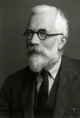
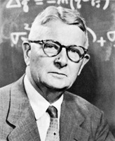
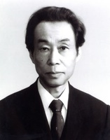
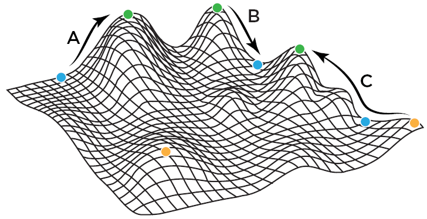

  

# Course information

|                    |                                                                |
|--------------------|----------------------------------------------------------------|
| **Instructor**     | Dr. Jeremy Van Cleve                                           |
| **E-mail**         | <jvancleve@uky.edu>                                            |
| **Phone**          | \(859\) 218-3020                                               |
| **Office**         | 216 THM                                                        |
| **Office hours**   | By appointment                                                 |
|                    |                                                                |
| **Class Time**     | T 11 AM – 12 PM                                                |
| **Class Location** | THM 108                                                        |
| **Website**        | <https://vancleve.github.io/BIO770-NaturalSelection> (Website) |
|                    | <https://uk.instructure.com/courses/2062737> (Canvas)          |
|                    |                                                                |
| **Credits**        | 1                                                              |

# Course description

The aim of this course will be to review some of the past and current
issues with the role and significance of natural selection in
evolutionary change. Although natural selection was the main focus in
Darwin’s *On the Origin of Species by Means of Natural Selection*,
evolutionary forces such as mutation, recombination, migration, and
genetic drift are integral to a complete understanding of evolutionary
change. The relative importance of these nonselective forces in shaping
organisms have long been a topic of substantial study and debate both
using both theoretical and empirical tools. Beginning with the rival
viewpoints of Sewall Wright and Ronald Fisher who helped establish the
“modern evolutionary synthesis”, the course will involve reading and
discussion of classic and recent scientific papers that investigate
selective and nonselective forces. Attention will be paid to the
conceptual and mathematical theory that provides a framework for
understanding evolutionary change. Surveys of the signature of selection
in population genomic data will also be discussed.

# Student learning outcomes

Through reading primary articles on the natural selection and other
evolutionary forces, students should be able to:

- Summarize the major strains of thought concerning the important of
  natural selection in shaping biological traits
- Connect current controversies regarding natural selection and
  evolution with their antecedents in the formation of the “modern
  synthesis” in the 1930s.
- Relate current issues regarding the detection of selection from
  genetic data and the assembly of genealogies and phylogenies to
  Kimura’s “neutral theory of molecular evolution” and the “modern
  synthesis”.
- Map the concepts of natural selection and adaptation to mathematical
  formalisms including “selection gradients”, “evolutionary equilibria”,
  and “evolutionarily stable strategies”.

# Course materials

The course will focus on readings from the primary literature with
augmentation by other sources as needed.

# Assignments

Before each class meeting, students should submit two questions about
the reading to the [Canvas course
site](https://uk.instructure.com/courses/2062737) under “Assignments”

# Grading

- 25%: questions submitted before each meeting
- 75%: participation in class discussion

# Class and reading schedule

| Week | Date   | Topic                                                                  | Readings (PDFs located on Canvas)                                                                                      |
|------|--------|------------------------------------------------------------------------|------------------------------------------------------------------------------------------------------------------------|
| 1    | Jan 10 | Fisher’s fundamental theorem                                           | Frank 2012 (Frank_2012_AdapativeLandscapeEvolutionaryBiology.pdf)                                                      |
|      |        |                                                                        |                                                                                                                        |
| 2    | Jan 17 | Fisher’s fundamental theorem                                           | Ewens 2011 (Ewens_2011_BritishJPhilosSci.pdf)                                                                          |
|      |        |                                                                        |                                                                                                                        |
| 3    | Jan 24 | Wright’s shifting balance                                              | Wright 1932 (Wright_1932_ProcSixthIntCongrGenet.pdf)                                                                   |
|      |        |                                                                        | Wright 1988 (Wright_1988_AmNat.pdf)                                                                                    |
|      |        |                                                                        | Lande 1985 (Lande_1985_Heredity.pdf)                                                                                   |
|      |        |                                                                        |                                                                                                                        |
| 4    | Jan 31 | Critique of the shifting balance                                       | Coyne et al. 1997 (Coyne.Barton.Turelli_1997_Evolution.pdf)                                                            |
|      |        |                                                                        |                                                                                                                        |
| 5    | Feb 7  | A new slice of the shifting balance                                    | Kryazhimskiy 2012 (Kryazhimskiy.Rice.Desai_2012_Evolution.pdf)                                                         |
|      |        |                                                                        | Nahum et al. 2015 (Nahum.Godfrey-Smith.Harding.etal_2015_ProcNatlAcadSciUSA.pdf)                                       |
|      |        |                                                                        | Van Cleve & Weissman 2015 (VanCleve.Weissman_2015_ProcNatlAcadSciUSA.pdf)                                              |
| 6    | Feb 14 | Lewontin and adaptationism                                             | Gould & Lewontin 1979 (Gould.Lewontin_1979_ProcRSocB.pdf),                                                             |
|      |        |                                                                        | [Lewontin 2015](https://thisviewoflife.com/the-spandrels-of-san-marco-revisited-an-interview-with-richard-c-lewontin/) |
|      |        |                                                                        |                                                                                                                        |
| 7    | Feb 21 | When fitness is not “maximized”                                        | Frean & Abraham 2001 (Frean.Abraham_2001_ProcRSocB.pdf),                                                               |
|      |        |                                                                        | Kerr et al. 2002 (Kerr.Riley.Feldman_2002_Nature.pdf)                                                                  |
| 8    | Feb 28 | The Price equation, kin selection, and group selection                 | Hamilton 1975 (Hamilton_1975_BiosocialAnthropology.pdf)                                                                |
|      |        |                                                                        |                                                                                                                        |
| 9    | Mar 7  | “Design” and fitness optimization                                      | West & Gardner 2013 (West.Gardner_2013_CurrBiol.pdf)                                                                   |
|      |        |                                                                        |                                                                                                                        |
|      | Mar 14 | **Spring break**                                                       |                                                                                                                        |
|      |        |                                                                        |                                                                                                                        |
| 10   | Mar 21 | Phylogeny and ecology                                                  | Kamilar & Cooper 2013 (Kamilar.Cooper_2013_PhilosTransRSocB.pdf)                                                       |
|      |        |                                                                        |                                                                                                                        |
| 11   | Mar 28 | Molecular evolution: the Neutral Theory                                | Kimura 1968 (Kimura_1968_Nature.pdf)                                                                                   |
|      |        |                                                                        | Kimura & Ohta 1971 (Kimura.Ohta_1971_Nature.pdf)                                                                       |
|      |        |                                                                        |                                                                                                                        |
| 12   | Apr 4  | Molecular evolution: detecting selection with intra/interspecific data | McDonald & Kreitman 1991 (McDonald.Kreitman_1991_Nature.pdf)                                                           |
|      |        |                                                                        | Smith & Eyre-Walker 2002(Smith.Eyre-Walker_2002_Nature.pdf)                                                            |
|      |        |                                                                        |                                                                                                                        |
| 13   | Apr 11 | Molecular evolution: linkage and selection: Drosophila                 | Begun & Aquadro 1992 (Begun.Aquadro_1992_Nature.pdf)                                                                   |
|      |        |                                                                        |                                                                                                                        |
| 14   | Apr 18 | Molecular evolution: linkage and selection: Humans                     | Enard et al. 2014 (Enard.Messer.Petrov_2014_GenomeRes.pdf)                                                             |
|      |        |                                                                        |                                                                                                                        |
| 15   | Apr 25 | Molecular evolution: Adaptation vs Drift in organismal complexity      | Lynch 2007 (Lynch_2007_ProcNatlAcadSciUSA.pdf)                                                                         |

<!-- ## Topics: -->
<!-- * fisher vs wright: mass selection vs shifting balance -->
<!--     - Ewens 2011 -->
<!--     - Wright 1932 / 1988 / Lande 1985 -->
<!--     - Coyne, Barton, Turelli 1997 -->
<!--     - Kryazhimskiy / Nahum / Van Cleve -->
<!-- * lewontin vs dawkins: spandrels or adaptations -->
<!--     - Lewontin & Gould / Lewontin 1979 / Lewontin interview -->
<!--     - Hastings 1981 / Frean & Abraham 2001 / Rankin 2005 -->
<!--     - Frank 1995 on the price equation -->
<!--     - Grafen 2008 -->
<!--     - Lehmann & Rousset (2014) -->
<!-- * kimura vs gillespie: drift or draft -->
<!-- ## Key Concepts: -->
<!-- * evolutionary change as a dynamical system -->
<!-- * selection as hill climbing -->
<!-- * adaptations as equilibrium points -->
<!-- ## Crazy topics: -->
<!-- * Steve Frank's work on evolution and information theory -->
<!-- * Jeremy England's theory of evolution via entropy production -->
<!-- * Selection and constraint: the role of landscape and the no free lunch theorems -->

# Course policies

Please see <https://www.uky.edu/universitysenate/acadpolicy> for a full
description of UK academic policies.

## Diversity and Inclusion

Members of the course are entitled to learn from each other in an open
and welcoming environment regardless of their racial, ethnic, gender,
and sexual identities. Conduct that is not respectful of these
identities or of the national origin, religion, and political beliefs
students and instructors will not be tolerated. Please report any
concerning conduct to the instructor.

## Face Covering/Distancing Policy

- Transmission of COVID-19 is still prevalent in Kentucky. The
  instructor and students are entitled to practices that reduce
  transmission including, and not limited to, wearing a high-quality
  mask and social distancing.

- In accordance with University guidelines, these transmission reducing
  practices are optional but the instructor encourages them. If COVID-19
  is a specific risk to a student or a student has any concerns about
  classroom COVID-19 policies, please contact the instructor as soon as
  possible.

- More information about COVID-19 and UK can be found here:
  <https://coronavirus.uky.edu/>

## Excused Absences

Students need to notify the instructor of absences prior to class when
possible. Senate Rule Senate Rules 5.2.5.2.1 defines the following as
acceptable reasons for excused absences: (a) significant illness, (b)
death of a family member, (c) trips for members of student organizations
sponsored by an educational unit, trips for University classes, and
trips for participation in intercollegiate athletic events, (d) major
religious holidays, (e) interviews for graduate/professional school or
full-time employment post-graduation, and (f) other circumstances found
to fit “reasonable cause for nonattendance” by the professor.

Students anticipating an absence for a major religious holiday are
responsible for notifying the instructor in writing of anticipated
absences due to their observance of such holidays no later than the last
day in the semester to add a class. Students are expected to withdraw
from the class if more than 20% of the classes scheduled for the
semester are missed (excused or unexcused) per university policy.

## Verification of Absences

Students may be asked to verify their absences in order for them to be
considered excused. Senate Rule 5.2.5.2.1 states that faculty have the
right to request appropriate verification when students claim an excused
absence due to: significant illness; death in the household, trips for
classes, trips sponsored by an educational unit and trips for
participation related to intercollegiate athletic events; and interviews
for full-time job opportunities after graduation and interviews for
graduate and professional school.

## Academic Integrity

Per university policy, students shall not plagiarize, cheat, or falsify
or misuse academic records. Students are expected to adhere to
University policy on cheating and plagiarism in all courses. The minimum
penalty for a first offense is a zero on the assignment on which the
offense occurred. If the offense is considered severe or the student has
other academic offenses on their record, more serious penalties, up to
suspension from the university may be imposed.

Plagiarism and cheating are serious breaches of academic conduct. Each
student is advised to become familiar with the various forms of academic
dishonesty as explained in the Code of Student Rights and
Responsibilities. Complete information can be found at the following
website: <https://www.uky.edu/ombud/>. A plea of ignorance is not
acceptable as a defense against the charge of academic dishonesty. It is
important that you review this information as all ideas borrowed from
others need to be properly credited.

Section 6.3 “Academic Offenses and Procedures” of the [Senate
Rules](http://www.uky.edu/universitysenate/rules-regulations) lays out
UK’s policy on academic integrity and says the following about plagarism
and

## Accommodations due to disability

In accordance with federal law, if you have a documented disability that
requires academic accommodations, please inform me as soon as possible.
In order to receive accommodations in a course, you must provide me with
a Letter of Accommodation from the Disability Resource Center (DRC).

The DRC coordinates campus disability services available to students
with disabilities. It is located on the corner of Rose Street and
Huguelet Drive in the Multidisciplinary Science Building, Suite 407. You
can reach them via phone at (859) 257-2754, via email (<drc@uky.edu>) or
visit their website (<https://www.uky.edu/DisabilityResourceCenter/>).
DRC accommodations are not retroactive and should therefore be
established with the DRC as early in the semester as is feasible.
