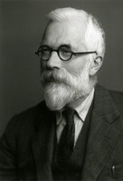
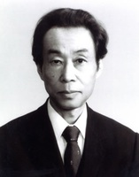
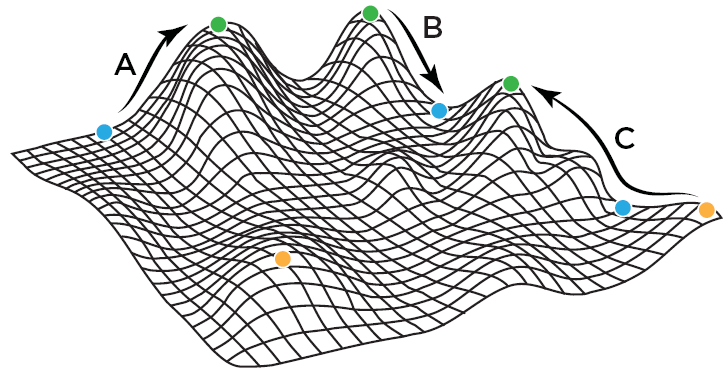

[canvas site]: https://uk.instructure.com/courses/2062737

   {height=200}

# Course information

|                    |                                                                |
|--------------------|----------------------------------------------------------------|
| **Instructor**     | Dr. Jeremy Van Cleve                                           |
| **E-mail**         | <jvancleve@uky.edu>                                            |
| **Phone**          | \(859\) 218-3020                                               |
| **Office**         | THM 216                                                        |
| **Office hours**   | By appointment                                                 |
|                    |                                                                |
| **Class Time**     | T 11 AM – 12 PM                                                |
| **Class Location** | THM 108                                                        |
| **Website**        | <https://vancleve.github.io/BIO770-NaturalSelection> (Website) |
|                    | <https://uk.instructure.com/courses/2062737> (Canvas)          |
|                    |                                                                |
| **Credits**        | 1                                                              |

# Course description

The aim of this course will be to review some of the past and current issues with the role and significance of natural selection in evolutionary change. Although natural selection was the main focus in Darwin's *On the Origin of Species by Means of Natural Selection*, evolutionary forces such as mutation, recombination, migration, and genetic drift are integral to a complete understanding of evolutionary change. The relative importance of these nonselective forces in shaping organisms have long been a topic of substantial study and debate both using both theoretical and empirical tools. Beginning with the rival viewpoints of Sewall Wright and Ronald Fisher who helped establish the "modern evolutionary synthesis", the course will involve reading and discussion of classic and recent scientific papers that investigate selective and nonselective forces. Attention will be paid to the conceptual and mathematical theory that provides a framework for understanding evolutionary change. Surveys of the signature of selection in population genomic data will also be discussed.

# Student learning outcomes

Through reading primary articles on the natural selection and other evolutionary forces, students should be able to:

* Summarize the major strains of thought concerning the important of natural selection in shaping biological traits
* Connect current controversies regarding natural selection and evolution with their antecedents in the formation of the "modern synthesis" in the 1930s.
* Relate current issues regarding the detection of selection from genetic data and the assembly of genealogies and phylogenies to Kimura's "neutral theory of molecular evolution" and the "modern synthesis".
* Map the concepts of natural selection and adaptation to mathematical formalisms including "selection gradients", "evolutionary equilibria", and "evolutionarily stable strategies".

# Course materials

The course will focus on readings from the primary literature with augmentation by other sources as needed.

# Course work

## Discussion leadership

Each student should sign up to be a co-leader for **TWO** topics. To sign up:

1. Go to the the [Canvas site][canvas site].
2. Click on "Calendar" on the left hand navigation bar.
3. Click "Find Appointment" on the right hand side.
4. Select "BIO770: Dr. Panglos..." and hit "Submit".
5. Sign up for **two dates** to co-lead discussion.

Leading the discussion means:

1. Reading the papers **thoroughly**.
2. Preparing topics and questions derived from the papers to generate discussion.
3. Doing additional background research on unfamiliar or challenging concepts or results so as to aid other students in discussion.
4. Using prepared topics/questions/background to stimulate discussion.
5. Maintaining a balance among the discussion contributions of all the students in class.
6. Incorporating note card questions for other students (see below) in discussion.

## Weekly note card questions

Before each class meeting, each student should prepare one or two questions based on the readings.

- Write each question out on a **note card** and include **your name**.
- **Hand in** your note cards to the discussion leaders for that week at the beginning of class.

# Grading

* 50%: Leading discussions
* 25%: Weekly note card question
* 25%: Participation in class discussion

